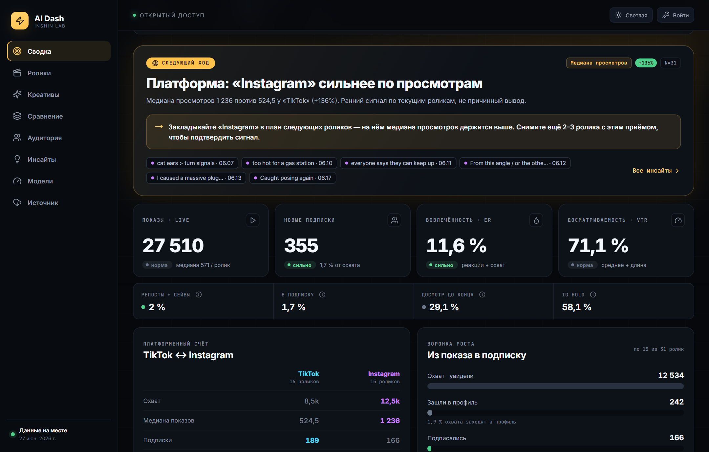
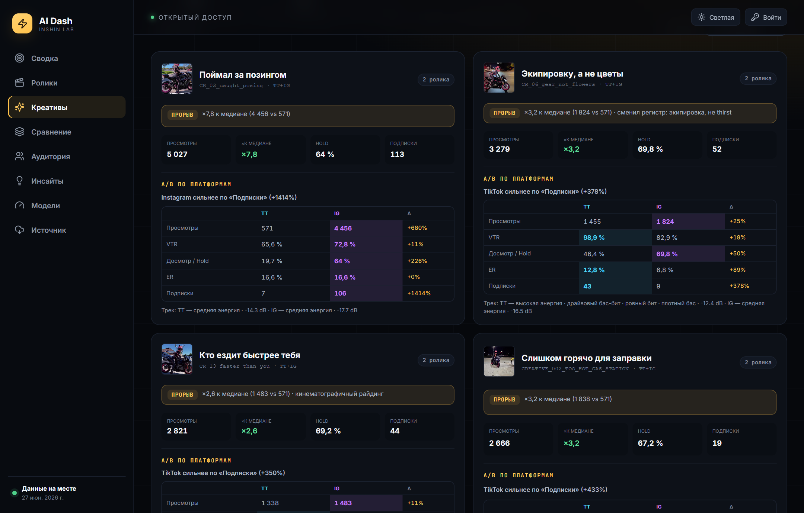
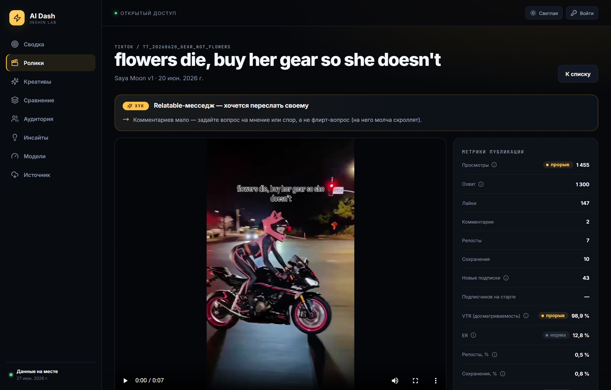
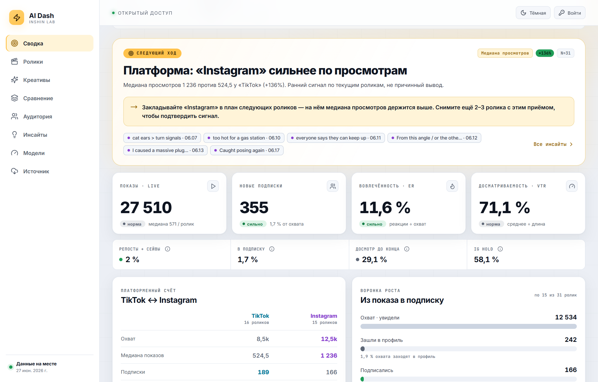

# AI Dash

> **Публичное демо-зеркало (showcase).** Это открытая копия внутреннего проекта
> для демонстрации архитектуры и кода. Секреты и приватные данные в репозиторий
> не входят: токены/ключи не коммитятся (только `.env.example` с плейсхолдерами),
> приватное хранилище (видео/скриншоты владельца, `entries.json`) живёт вне
> репозитория. `data/manual-intake.json` — небольшой сид реальных публикаций;
> вся аналитика и так открыта на живом дашборде ниже. Продакшен-деплой
> настроен в приватном репозитории. Лицензия — см. [`LICENSE`](LICENSE).
>
> 🔗 Живой дашборд: <https://inshinlab.com/ai-dash/>

Внутренний сервис аналитики AI-моделей для Instagram Reels и TikTok:

- production: `https://inshinlab.com/ai-dash/`;
- дашборд открывается сразу, без логина (только просмотр);
- добавление/редактирование/удаление роликов — в режиме владельца по токену;
- все данные живут на сервере (ручной ввод владельца), без внешних источников.

## Интерфейс

**Сводка — кокпит роста.** «Следующий ход» (сильнейший сигнал как конкретная
рекомендация), KPI-кокпит, счёт TikTok ↔ Instagram, воронка роста.



**Креативы — кросс-платформенный A/B.** Один Creative ID объединяет публикации
TikTok и Instagram: превью, аномалия с причиной и сравнение по площадкам.



**Страница ролика.** Хук-архетип и «что изменить в следующий раз», воронка,
источники трафика и демография.



**Светлая тема** (контраст под WCAG AA, тумблер в шапке).



## Что реализовано

- **ручной ввод роликов прямо в интерфейсе**: модель → платформа → дата →
  загрузка видео → загрузка нескольких скриншотов → метрики → теги/тема/формат/
  хук/заметка → сохранение; редактирование, удаление с подтверждением,
  валидация, защита от дублей, понятные ошибки и состояния загрузки;
- writable-стор `entries.json` в `STORAGE_DIR` (вне git-репозитория, переживает
  деплои), атомарная запись с `.bak`-ротацией и сохранением повреждённых файлов;
- объединение данных по `postId` без двойного учёта: записи владельца
  накладываются поверх seed-публикаций из `manual-intake.json`;
- **Сводка (кокпит роста)** — экран «решения в центре»: «Следующий ход»
  (сильнейший сигнал как конкретная рекомендация на следующий ролик), KPI-кокпит
  (показы, подписки, ER, VTR), счёт **TikTok ↔ Instagram** (кросс-платформенный
  A/B по охвату/репостам/подпискам), воронка роста (охват → заходы в профиль →
  подписки), блок «что повторять / чего избегать» и лидерборд выигрышного
  содержания; фильтры по периоду, платформе, модели, формату, хуку, тегу,
  длительности;
- страница ролика: хук-архетип и «что изменить в следующий раз», видео, все
  метрики с бенчмарк-тирами, воронка и «возвратные действия» (репосты+сейвы),
  источники трафика и демография ролика, сравнение с моделью и платформой
  (процентиль, позиция `#N из M`, отклонение от медианы, флаг статистического
  выброса, короткий вердикт);
- креативы: один Creative ID объединяет публикации TikTok и Instagram — превью,
  аномалия с причиной (прорыв / зарезан FYP / длинный→низкий досмотр / слабый
  охват) и A/B по платформам;
- сравнение: ролики бок о бок (общие play/pause, seek, loop, speed) и агрегаты
  по модели/платформе/теме/формату/хуку/тегу/энергии трека;
- аудитория: доли сегментов, взвешенные по абсолютному охвату каждого ролика
  (ролик с большим охватом весит сильнее), с примерным числом зрителей;
- ffprobe-метаданные (длительность, разрешение) и ffmpeg-thumbnail (генерится
  при первом запросе, кэшируется на диск); стриминг видео с Range;
- инсайты без Viral Score, только для групп `n >= 3`, с размером выборки,
  метрикой-источником, конкретной рекомендацией и ссылками на публикации;
- разделы: **Сводка, Ролики, Креативы, Сравнение, Аудитория, Инсайты, Модели,
  Источник**.

### Режим владельца и безопасность

Все мутации (`POST/PATCH/DELETE /api/entries`, загрузка медиа, `POST /api/media`,
`POST /api/sync`, `PATCH /api/notes/:id`) требуют токен владельца в заголовке
`X-AI-Dash-Admin-Token` (timing-safe сравнение). Токен задаётся в `ADMIN_TOKEN`
(алиас — `CODEX_ADMIN_TOKEN`).

В браузере владелец один раз вводит токен через кнопку «Войти»; токен хранится
только в `localStorage` этого устройства и шлётся кастомным заголовком (поэтому
CSRF невозможен — кросс-сайтовый запрос не может выставить такой заголовок).
Без токена интерфейс работает только на чтение. Загрузки валидируются по MIME и
сигнатуре файла, есть пер-IP rate-limit и ограничение параллельных ffprobe/ffmpeg.

## Дизайн и UX

Дизайн-система «Mission Control» — спокойный near-black холст с тёплым **золотым**
акцентом, который значит ровно одно: «ход / прорыв / рекомендация». Дисциплина
цвета: изумруд = плюс, коралл = минус, slate = норма, cyan = TikTok, violet =
Instagram. Шрифты бандлятся локально (без CDN): `Inter` (текст/заголовки) и
`JetBrains Mono` (слой телеметрии — лейблы, ID, единицы, дельты), оба с
кириллическими сабсетами. Тёмная и светлая темы (тумблер в шапке, контраст под
WCAG AA). IA построена вокруг вопросов «что сработало / почему / что снять
дальше». Подробности и решения ревью — [`docs/cockpit-redesign.md`](docs/cockpit-redesign.md).

## Эволюция в SaaS · досбор аналитики

Идёт превращение внутреннего инструмента в multi‑tenant SaaS. Первый production‑ready
срез — подсистема **«Досбор данных»**: автоматически определяет, каких метрик не хватает
(по тому, что реально отдают API Instagram/TikTok), и помогает дособрать остальное с
телефона несколькими скриншотами.

- мобильный мастер на `/ai-dash/complete` (отдельная страница, не трогает основной SPA):
  задание → инструкция → «Открыть в Instagram/TikTok» → 2–3 скриншота → авто‑распознавание
  → подтверждение только сомнительных значений;
- **метрик‑снапшоты с провенансом** (источник/время/уверенность, `null ≠ 0`), история не
  теряется, значения проецируются обратно в текущий дашборд без изменений аналитики;
- **коннектор‑абстракция** + mock‑коннекторы Instagram/TikTok на фикстурах официальных
  payload’ов (готовы к подключению живого OAuth);
- owner‑gated эндпоинты `/api/completion/*`; новый стор `STORAGE_DIR/saas-snapshots.json`
  (аддитивно, `entries.json` не трогается).

Всё аддитивно, `npm run check` зелёный, существующий дашборд/Creative ID/аналитика работают
как раньше. Исследование и проектирование:

- [`docs/current-architecture-audit.md`](docs/current-architecture-audit.md) — аудит текущей системы;
- [`docs/social-api-feasibility.md`](docs/social-api-feasibility.md) — матрица покрытия полей (что отдают API, что только скриншоты);
- [`docs/manual-analytics-completion.md`](docs/manual-analytics-completion.md) — подсистема досбора;
- [`docs/platform-app-setup.md`](docs/platform-app-setup.md) — настройка Meta/TikTok приложений (действия владельца);
- [`docs/adr/001-social-data-strategy.md`](docs/adr/001-social-data-strategy.md), [`docs/adr/002-saas-architecture.md`](docs/adr/002-saas-architecture.md) — решения;
- [`docs/data-migration-plan.md`](docs/data-migration-plan.md), [`docs/deployment-runbook.md`](docs/deployment-runbook.md) — миграция и деплой.

## Стек и архитектура

- React 19 + Vite + TypeScript;
- Express 5;
- Recharts;
- systemd + nginx;
- постоянный файловый storage вне nginx web-root и атомарный JSON metadata store.

```text
owner UI ─┐
          ▼
   Express API → browser
          ↘ /var/lib/ai-dash/entries.json     (записи владельца, source of truth)
          ↘ /var/lib/ai-dash/videos           (загруженные MP4/MOV/WebM)
          ↘ /var/lib/ai-dash/screenshots      (скриншоты статистики)
          ↘ /var/lib/ai-dash/thumbnails       (кадры ffmpeg)
          ↘ /var/lib/ai-dash/metadata.json    (медиа-связи + заметки)
```

В metadata store находятся только связи с Post/Creative ID, имя файла, MIME type,
размер, длительность, разрешение и имя thumbnail.

## MVP manual intake

Сид реальных роликов хранится в
[`data/manual-intake.json`](data/manual-intake.json). Сервер отдаёт эти
LIVE-публикации в `/api/data`, а поверх них накладываются записи владельца из
`entries.json`. Дашборд открывается всегда — без внешних зависимостей.

Файлы из манифеста не коммитятся:

- локально: `storage/intake/videos` и `storage/intake/screenshots`;
- production: `/var/lib/ai-dash/intake/videos` и
  `/var/lib/ai-dash/intake/screenshots`.

На сайте видео открываются через `/ai-dash/media/:id/video`, а исходные
скриншоты статистики — через `/ai-dash/screenshots/:id`.

## Семантика метрик

- `Record type = EXAMPLE` исключается из всей аналитики.
- ER и все %-реакции (лайки/комментарии/репосты/сохранения/в подписку) считаются
  **от охвата (reach)** — совпадает с тем, что показывает сам Instagram.
  `engagementRateByViews` оставлен отдельно как нормализованная версия для
  честного сравнения площадок между собой.
- VTR (досматриваемость) = среднее время просмотра ÷ длительность (обе площадки);
  «досмотр до конца» = TikTok completion / Instagram hold — это разные метрики и
  не объединяются в одну.
- Бенчмарк-тиры (слабо / норма / сильно / прорыв) платформо-зависимые: TikTok по
  reach-rate примерно вдвое выше Instagram, поэтому пороги для площадок разные.
- Аудитория взвешивается по абсолютному охвату: доля сегмента × охват ролика,
  суммируется по выбранным роликам — ближе к реальному числу людей, чем простое
  среднее по процентам.
- Хуки сгруппированы в архетипы (петля интриги, вопрос-спор, провокация,
  relatable-месседж, мини-история, флекс, чистый визуал), а не по сырому тексту.

## Локальный запуск

```bash
npm install
cp .env.example .env
npm run dev
```

`npm run dev` поднимает фронт (Vite, порт 5173) и API (tsx) вместе. Для работы
только над интерфейсом без локального бэкенда есть `npm run dev:preview` — Vite
проксирует API/медиа на production, поэтому HMR крутится на реальных данных.

Для production-like проверки:

```bash
npm run check
npm run start
```

Frontend: `http://localhost:5173/ai-dash/`
API: `http://127.0.0.1:4310/ai-dash/api/health`

## Environment variables

Скопируйте [`.env.example`](.env.example). Обязательные:

- `ADMIN_TOKEN` — минимум 32 случайных символа, токен владельца (алиас —
  `CODEX_ADMIN_TOKEN`, остаётся рабочим);
- `STORAGE_DIR=/var/lib/ai-dash` — постоянное хранилище вне репозитория.

Также доступны `PORT`, `PUBLIC_URL`, `CACHE_TTL_SECONDS`, `MAX_UPLOAD_MB`,
`MAX_SCREENSHOT_MB`, `MAX_SCREENSHOT_FILES`, `FFMPEG_PATH`, `FFPROBE_PATH`.
Секреты и токены никогда не коммитятся.

## Проверки

```bash
npm run lint
npm run test
npm run build
npm audit --omit=dev
```

## Production

Инструкция, systemd unit и безопасный nginx location находятся в
[`DEPLOY.md`](DEPLOY.md) и `deploy/`. Nginx проксирует только `/ai-dash/`;
корень и остальные подпроекты `inshinlab.com` не изменяются.
